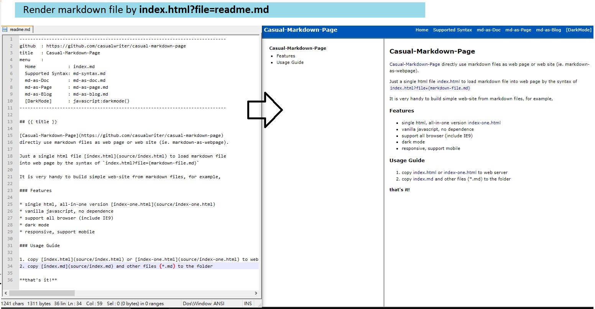

## casual-markdown-page

[Casual-Markdown-Page](https://github.com/casualwriter/casual-markdown-page) directly render markdown files as web page or web site (ie. markdown-as-webpage).

Empower by a single html file [index.html](source/index.html), to load markdown file into web page by the syntax of `index.html?file={markdown-file.md}`

It is very handy to build simple web-site from markdown files, for example, 

* github (self-host): https://raw.githack.com/casualwriter/casual-markdown-page/main/source/index.html
* all-in-one version: https://raw.githack.com/casualwriter/casual-markdown-page/main/source/index-one.html
* github page: https://casualwriter.github.io/casual-markdown
* github page: https://casualwriter.github.io/

or direct render any md file from web. for example

* this page: https://casualwriter.github.io/casual-markdown?file=https://raw.githack.com/casualwriter/powerpage/main/README.md
* Build your own X:  https://casualwriter.github.io/casual-markdown?file=https://raw.githubusercontent.com/codecrafters-io/build-your-own-x/master/README.md

### Features

* single html, all-in-one version [index-one.html](source/index-one.html)
* vanilla javascript, no dependence
* support all browser (include IE9)
* dark mode, or customized themes
* responsive, support mobile

### Usage Guide

1. copy [index.html](source/index.html) or [index-one.html](source/index-one.html) to web server
2. copy [index.md](source/index.md) and other files (*.md) to the folder

**that's it!**

* by default, it will load `index.md` as home page.
* hotkey [alt-s] to show markdown html for developer
* hotkey [alt-k] to showpage in dark mode
* for mobile, click on title to show/hide TOC. 
* use front matter for page configuration (title, menu, navigation), for example

~~~
-----------------------------------------------------------------------------
github  : https://github.com/casualwriter/casual-markdown 
title   : Casual-Markdown 
style   : #header { background: RoyalBlue } // additional style, optional
menu    :    
  Home            : index.md
  Supported Syntax: md-syntax.md
  md-as-Doc       : md-as-doc.md
  md-as-Page      : md-as-page.md
  md-as-Blog      : md-as-blog.md
    : javascript:darkmode()
-----------------------------------------------------------------------------

## {{ title }} 

[casual-markdown]({{github}}) is a super lightweight RegExp-based markdown parser, 
with TOC and scrollspy support
~~~ 

### Modification History

* 2022/08/11, v0.60, initial release.
* 2022/08/12, add all-in-one version. [index-one.html](source/index-one.html)
* 2022/12/28, v0.62, minor update
 

